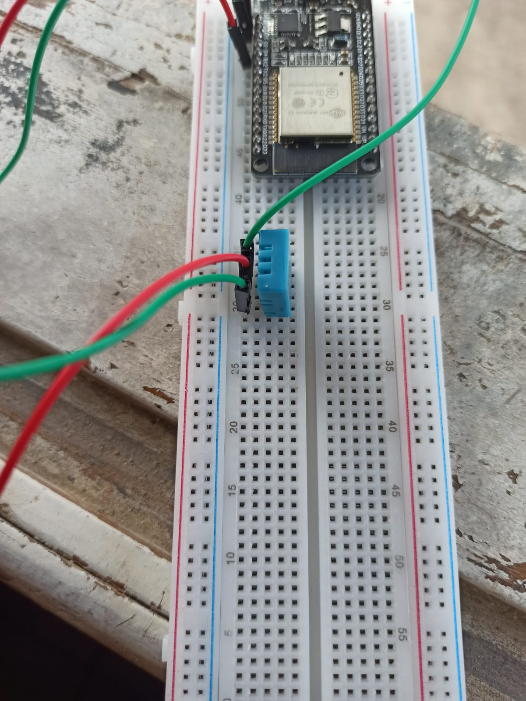
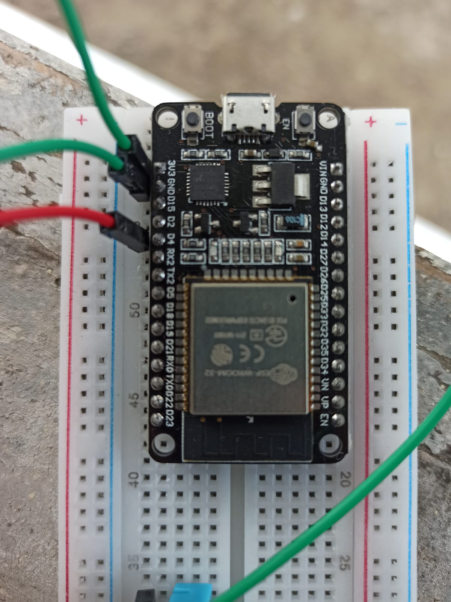
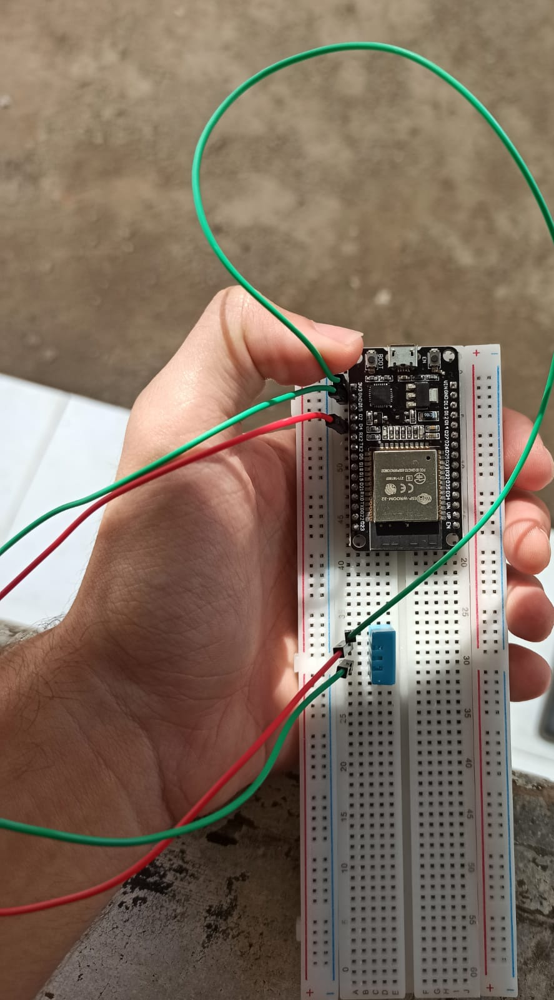
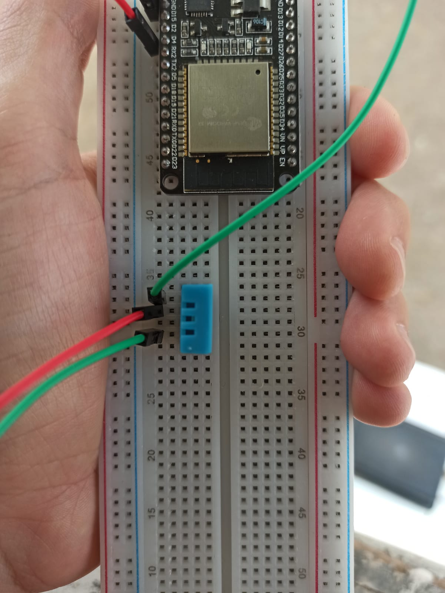

# Monitor de Temperatura com ESP32 e Python 🌡️🔧

Este projeto é uma implementação prática de um monitor de temperatura utilizando uma ESP32 e o sensor DHT11. O código e a inspiração para este projeto foram disponibilizados pelo Professor Neto Paschoal em seu vídeo educacional [link para o vídeo](https://www.youtube.com/watch?v=45VCTB7f0sM&t=1s), e o repositório original pode ser encontrado em [https://github.com/netopaschoal/Monitor-de-temperatura-com-esp8266-e-python](https://github.com/netopaschoal/Monitor-de-temperatura-com-esp8266-e-python).

## Agradecimentos 🙌

Gostaria de expressar minha sincera gratidão ao Professor Neto Paschoal por compartilhar seu conhecimento e disponibilizar o código-fonte deste projeto valioso. Obrigado por contribuir para a comunidade e promover o aprendizado prático.

## Visão Geral do Projeto 👀
A montagem, demonstração e uma breve explicação do projeto se encontra também no Youtube.
**Nome do vídeo: ESP32 + Sensor DHT - Projeto sensor de umidade e temperatura
Link: [Assista ao vídeo](https://www.youtube.com/watch?v=oPxahV4vImI).**

O objetivo deste projeto é utilizar uma ESP32 em conjunto com o sensor DHT11 para monitorar a temperatura e umidade ambiente. O código .ino é responsável de coletar as informações do DHT11 (sensor de umidade e temperatura) e armazená-los. Logo após isso poderemos utilizar o algoritmo desenvolvido em Python para fazer uma requisição a este web server que foi criado e consequentemente podemos extrair, transformar e carregar novamentes os dados. Desenvolvemos um pequeno front-end para que os dados não sejam mostrados de forma "livre".

## Montagem ESP32 + DHT11 🔨:
- Conecte a ESP32 e o sensor DHT11 na protoboard utilizando jumpers. (algumas imagens de como está a conexexão entre: a ESP32, o DHT, o sensor e jumpers).
 
---
-  Certifique-se que o DHT esteja da mesma forma da imagem.





--- 
*  1o jumper ao lado do 3V3 da ESP32 vai na primeira perninha do DHT11. 
*  2o jumper ao lado do GND da ESP32 vai na segunda perninha do DHT. 
* 3o jumper no meu caso estou utilizando a porta D4 da ESP32, se você for utilizar também a D4 coloque um jumper ao lado do D4 na ESP32 pule 1 perninha no DHT11 e conecte-o na ultima perninha do DHT1.

## 1. Configurando a ESP32 + DHT11 🧩:
Conecte um cabo micro USB na ESP32 e a porta USB do gabinete nas portas traseiras. Instale algumas bibliotecas que forem recomendadas (se caso der erro por falta de bibliotecas instale as que faltam).
Compile o código na IDE do Arduino. No Serial Monitor aparecerá algo como:
```css
Copy code
Connected to Xiaomi_1DAD
IP address: 192.168.31.209 
MDNS responder started
HTTP server started
```
Acesse o servidor web da ESP32 pelo navegador usando o endereço IP atribuído, neste caso o endereço foi este "http://192.168.31.209", no seu caso pode ser que mude, esse dado é gerado por conta do meu roteador. Os dados, como umidade e temperatura, são exibidos no formato "umidadeEtemperatura", por exemplo, 60.00e30.00.
# 2. Configurando o Ambiente Python 🐍
## Certifique-se de ter as bibliotecas: *flask* e *requests*, caso não tenha:
```python
pip install flask requests
``` 
---
Em primeiro lugar, troque o "http://192.168.31.209/" pelo IP que foi gerado na Arduino IDE.
Abra um terminal e navegue até o diretório onde está o código Python usando o comando cd.
No meu caso eu digitei: 
```css
CD "C:\esp32_monitor"

```
Após abrir a pasta digite:
```python
python server.py
```
No meu caso ele retornou algo como:
```python
* Serving Flask app 'server'
 * Debug mode: on
WARNING: This is a development server. Do not use it in a production deployment. Use a production WSGI server instead.
 * Running on http://127.0.0.1:5000
Press CTRL+C to quit
 * Restarting with stat
 * Debugger is active!
 ```
Após isso entre nesse link: "http://127.0.0.1:5000". Você verá o site configurado com HTML e CSS. Caso queira ver os dados em formato json digite:
```python:
http://127.0.0.1:5000/data
```
Certifique-se de ter as bibliotecas necessárias instaladas no ambiente Python.


## Importantes 🎈:

```python 
O caminho C:\esp32_monitor no terminal retorna o endereço http://127.0.0.1:5000, que é criado pelo Flask.
```

```python
O endpoint /data em http://127.0.0.1:5000/data fornece os dados em formato JSON.
```

A parte do QT é opcional e pode ser explorada conforme a preferência do usuário.

Espero que essas instruções detalhadas facilitem a configuração e execução do seu projeto! Se houver mais detalhes ou ajustes necessários, estou à disposição. 🚀
## Estrutura do Projeto 🏗️

- **ESP32:**
  - O ESP32 é configurado como um servidor web e fornece os dados do sensor através do endpoint `http://192.168.31.209/`.

- **Código Python:**
  - O código Python utiliza a biblioteca PyQt5 para criar uma interface gráfica simples.
  - Os dados do sensor são obtidos através de requisições HTTP para o servidor ESP32.
  - A interface é atualizada automaticamente a cada 2 segundos com os valores mais recentes de temperatura e umidade.

- **Flask Web Server:**
  - O ESP32 envia os dados do sensor para um servidor Flask que está escutando em `http://127.0.0.1:5000/data`.
  - O servidor Flask também disponibiliza uma página web para visualização dos dados em `http://127.0.0.1:5000`.


## Observações 📢:
O código Python realiza uma requisição a cada 2 segundos para obter os dados da ESP32.

O caminho C:\esp32_monitor no terminal retorna o endereço http://127.0.0.1:5000.

O endpoint /data em http://127.0.0.1:5000/data fornece os dados em formato JSON.

A parte do QT é opcional e pode ser explorada conforme a preferência do usuário.

Espero que essas instruções detalhadas facilitem a configuração e execução do seu projeto! Se houver mais detalhes ou ajustes necessários, estou à disposição. 🚀

## Contexto Acadêmico 🎓
Este projeto foi desenvolvido na Universidade Federal de Alagoas, na matéria: Organização e Arquitetura de Computadores. Os professores responsáveis por ministrar o curso foram a Professora Raquel Cabral e o Professor Tácito Neves.
### Alunos:
1. Riquelme Magalhães de Souza;
2. João Carlos Araujo dos Anjos Silva;
3. Isaac Kawan da Silva Souza;
4. José Vinicius Cavalcante Soares
---

Esperamos que este projeto seja útil para aprender e aplicar conceitos práticos relacionados a IoT e monitoramento de sensores. Sinta-se à vontade para explorar, modificar e compartilhar este código para fins educacionais.